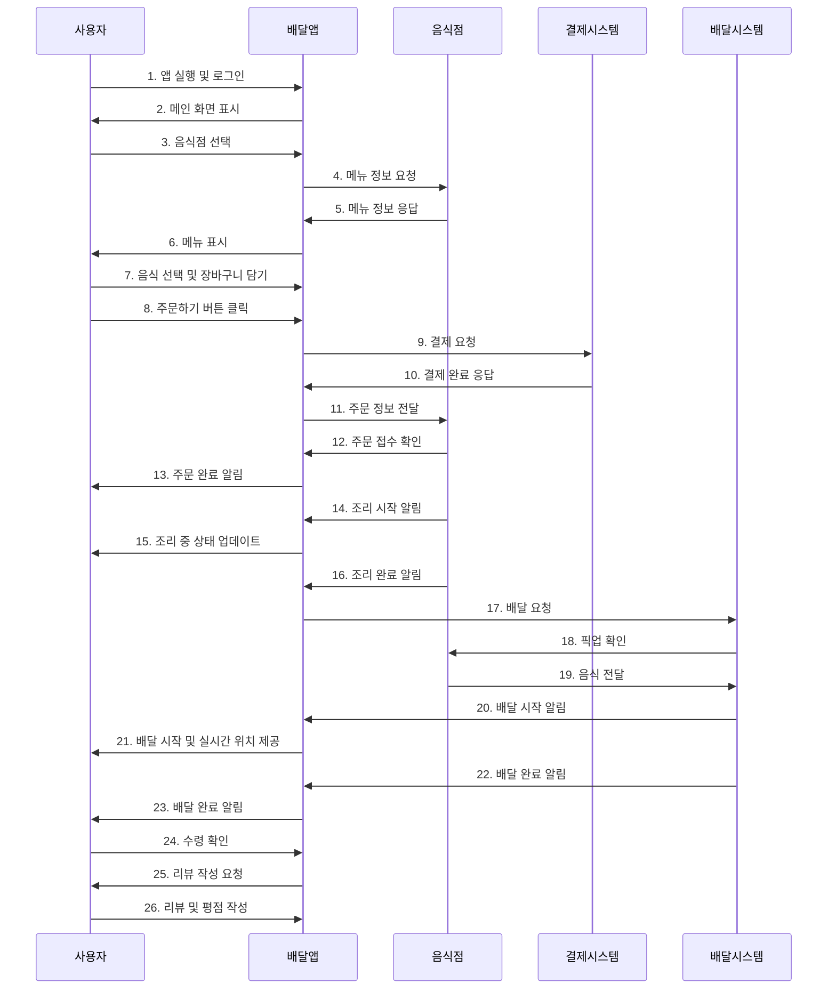

# 음식 배달 시스템 - 시퀀스 다이어그램 & 샘플 코드
> 일상 속 소프트웨어 사용 사례를 주제로 한 음식 배달 시스템의 시퀀스 다이어그램 모델링 및 Python 구현

## 프로젝트 개요
이 프로젝트는 우리가 일상에서 자주 사용하는 **음식 배달 앱**의 동작 과정을 시퀀스 다이어그램으로 분석하고 구현함.

## 시퀀스 다이어그램
### 주요 참여자 (Participants)

- 사용자: 음식을 주문하는 고객
- 배달앱: 주문을 중개하는 모바일 애플리케이션
- 음식점: 음식을 조리하고 제공하는 업체
- 결제시스템: 결제를 처리하는 외부 시스템
- 배달시스템: 음식 배달을 담당하는 시스템

### 주요 프로세스 흐름

1. 사용자 인증 및 앱 접근
2. 음식점 선택 및 메뉴 조회
3. 음식 선택 및 장바구니 관리
4. 주문 및 결제 처리
5. 음식점 주문 접수 및 조리
6. 배달 시스템 연동 및 배송
7. 배달 완료 및 리뷰 작성

## 구현 코드 아키텍처 설계

- User: 사용자 정보 및 행동 관리
- DeliveryApp: 배달 앱의 핵심 비즈니스 로직
- Restaurant: 음식점 정보 및 주문 처리
- PaymentSystem: 결제 처리 시스템
- DeliverySystem: 배달 관리 시스템
- Order: 주문 정보를 담는 데이터 클래스

### 실행 결과 예시

1. 사용자 로그인
[사용자] 홍길동동님이 로그인했습니다.
[배달앱] 메인 화면을 표시합니다.

2. 음식점 선택 및 메뉴 조회
[사용자] 음식점 선택: REST001
[음식점] 맛있는 치킨집 메뉴 정보 제공
[배달앱] 메뉴 정보 수신: 2개 메뉴

3. 음식 선택 및 장바구니 담기
[사용자] 장바구니 추가: 후라이드 치킨 x 1
[배달앱] 장바구니 업데이트 완료
[사용자] 장바구니 추가: 양념치킨 x 1
[배달앱] 장바구니 업데이트 완료

4. 주문 및 결제
[사용자] 주문 요청
[결제시스템] 결제 처리 시작: 37000원
[결제시스템] 결제 완료: PAY_20250101_123456
[음식점] 주문 접수: ORDER_20250101_123456
[음식점] 조리 시작: ORDER_20250101_123456
[배달앱] 주문 완료: ORDER_20250101_123456

5. 조리 과정
[음식점] 조리 완료: ORDER_20250101_123456
[배달앱] 주문 상태 업데이트: ORDER_20250101_123456 -> 조리완료
[배달시스템] 배달 시작: ORDER_20250101_123456
[배달시스템] 기사1이(가) 배달을 시작합니다.
[배달시스템] 배달 완료: ORDER_20250101_123456

6. 배달 완료 확인
[사용자] 배달 완료 확인: ORDER_20250101_123456

7. 리뷰 작성
[사용자] 리뷰 작성: 5점 - 맛있게 잘 먹었습니다!

## 모듈 평가

### 응집도 (Cohesion) 분석

User | 기능적 응집도 | 9/10 | 매우 높음 - 사용자 관련 기능만 담당 
Restaurant | 기능적 응집도 | 8/10 | 높음 - 음식점 운영 기능 집중 
PaymentSystem | 기능적 응집도 | 8/10 | 높음 - 결제 처리 전담 
DeliverySystem | 기능적 응집도 | 7/10 | 양호 - 배달 관련 기능 통합 
DeliveryApp | 논리적 응집도 | 6/10 | 보통 - 다양한 책임으로 복잡성 증가 

### 결합도 (Coupling) 분석

PaymentSystem ↔ 다른 모듈 | 데이터 결합도 | 9/10 | 매우 좋음 - 독립적 동작 
DeliverySystem ↔ Order | 데이터 결합도 | 8/10 | 좋음 - 느슨한 결합 
User ↔ DeliveryApp | 스탬프 결합도 | 7/10 | 양호 - 객체 전달 방식 
Restaurant ↔ DeliveryApp | 제어 결합도 | 5/10 | 보통 - 직접 메서드 호출 
DeliveryApp ↔ 모든 모듈 | 내용 결합도 | 4/10 | 개선 필요 - 강한 의존성 

### 종합 평가

종합 평가: B+ (77/100)
- 응집도: 7.5/10 - 대부분의 클래스가 단일 책임을 잘 수행함
- 결합도: 6.5/10 - 일부 모듈 간 강한 결합도 존재
- 전체 설계: 8/10 - 실제 비즈니스 로직을 잘 반영한 직관적 구조
